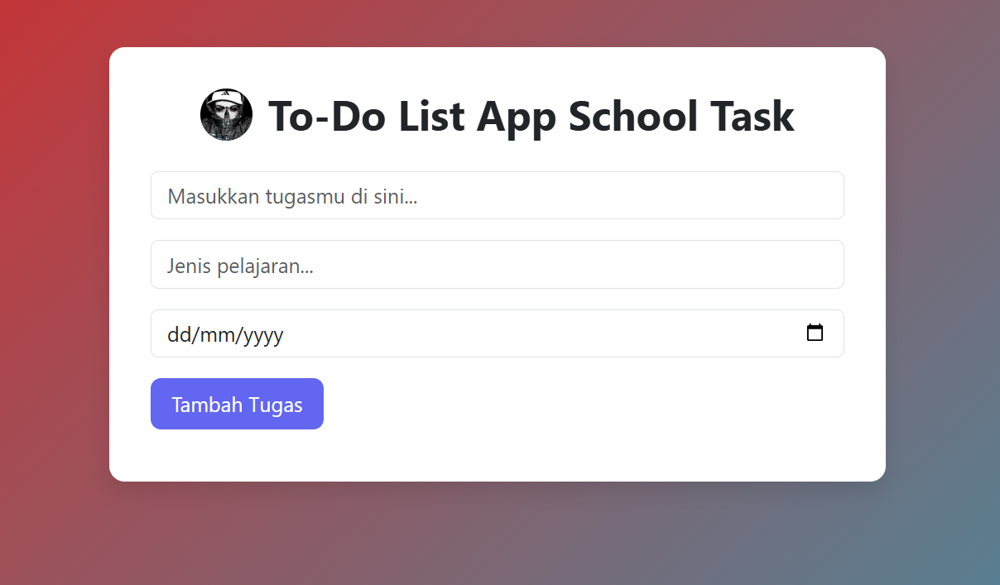

# **To-Do List App — School Task**

**Deskripsi singkat**
Aplikasi **To-Do List** sederhana buat bantu kamu catet tugas sekolah: isi nama tugas, pilih **mata pelajaran**, dan set **deadline**. UI clean & responsive, cocok buat tugas sekolah atau project portofolio.

---

## **✨ Fitur**
- **Menambahkan tugas** (title, mata pelajaran, tanggal deadline)  
- **Date picker** untuk pilih tanggal deadline  
- UI yang **responsive** dan mudah dipakai  
- Bisa dikembangkan buat **localStorage**, edit, hapus, filter, dll.

---

## **📸 Preview**
Tambahkan screenshot di folder repo dan ganti nama file sesuai:  
`./assets/preview.png`

```markdown

